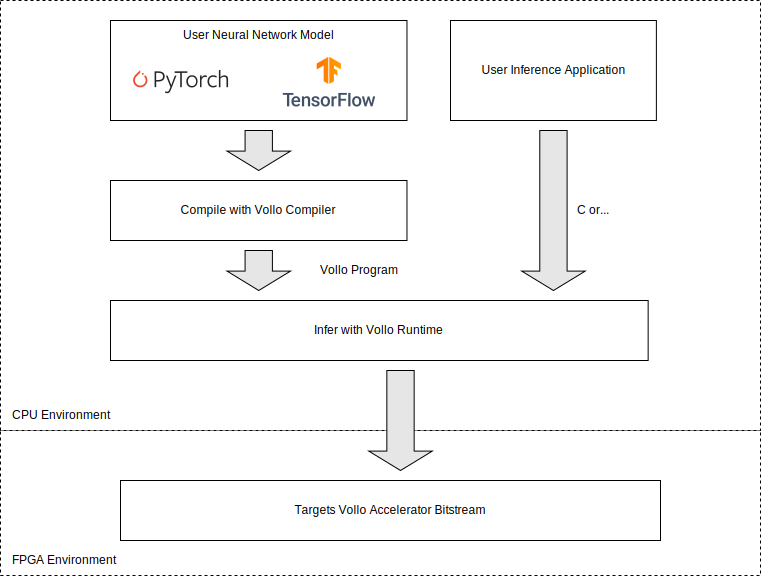

# Getting Started

You can get started with evaluating your ML model's performance on Vollo using
the Vollo compiler and Vollo virtual machine (VM), which don't require an FPGA
accelerator.

When you are ready, you can run inferences with your model on a Vollo FPGA
accelerator using an evaluation license.

## Performance estimation and model design with the Vollo compiler

You can use the Vollo compiler and VM to compile and estimate the performance of
your model in an ML user's environment without any accelerator.

The Vollo compiler and Vollo VM execution time is typically on the order of
seconds, enabling fast model iteration for tuning models to meet a latency
target.

To estimate performance of your model with the Vollo SDK:

1. [Download and extract](installation.md) the Vollo SDK.

2. [Install the Vollo compiler](vollo-compiler.md#installation) Python libraries.

3. Compile your model using the Vollo compiler and run the compiled model in the
   Vollo VM to generate a compute latency estimate
   that will be achieved with Vollo.

   See Vollo compiler [Example 1](example-1-mlp.md) for a fully worked example
   of this including performance estimation.

4. Add in [IO latency](benchmark-io.md) for your model characteristics in
   order to estimate end to end latency.

5. Iterate on your model architecture to meet your combined latency and accuracy
   requirements.

## Validating inference performance using the Vollo FPGA accelerator

When you are ready to run inferences with your models on a Vollo accelerator,
you will need a [compatible FPGA based PCIe accelerator
card](system-requirements.md#accelerator-card-requirements) and a [Vollo
license](licensing.md).

Evaluation licenses can be provided free of charge by contacting
<vollo@myrtle.ai>.

To validate inference performance on Vollo:

<!-- markdownlint-disable MD029 -->

6. Follow the steps to [program](programming-the-fpga.md) and
   [license](licensing.md) the FPGA.

7. Compile your model and save it as a `.vollo` program file using the Vollo
   compiler.

   See Vollo compiler [Example 1](example-1-mlp.md) for a fully worked example.

8. Run and benchmark your model on the accelerator using [the Vollo runtime C
   example](running-an-example.md).

   Make sure to pass the example application the path to your saved `.vollo`
   program when you invoke it on the command line.

<!-- markdownlint-enable MD029 -->

Note that the Vollo SDK includes prebuilt FPGA bitstreams for selected PCIe
accelerator cards so no FPGA compilation or configuration is required after
initial accelerator setup.
As a result loading user models to run on Vollo takes under a second, enabling
fast onboard iteration and evaluation of different models.
