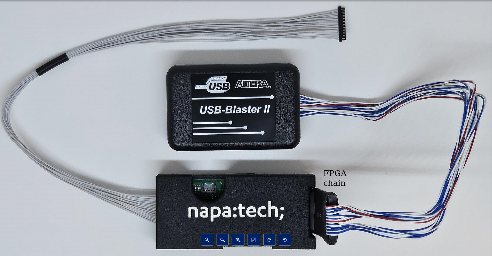
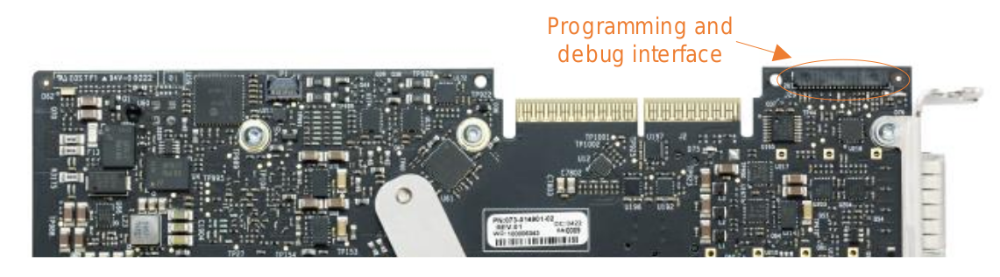
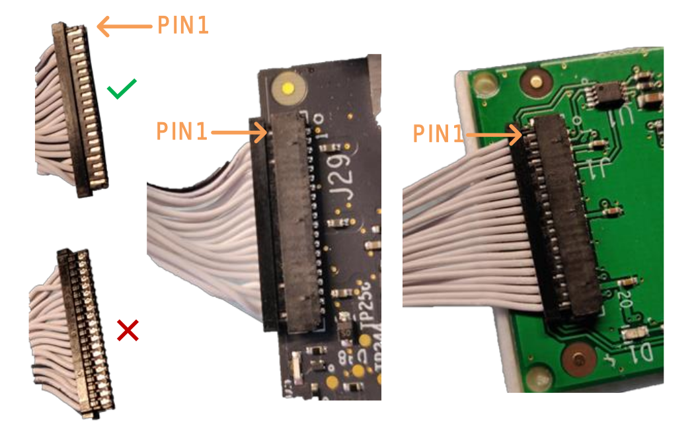

# Programming the Agilex FPGA

## Download the bitstream for your FPGA

The bitstream is available on the [Github Release page](https://github.com/MyrtleSoftware/vollo-sdk/releases/) alongside the Vollo SDK.
For example to download the bitstream for the Agilex `ia840f` board with the `c2b64d` configuration of Vollo:

```sh
curl -LO https://github.com/MyrtleSoftware/vollo-sdk/releases/download/v25.0.1/vollo-ia840f-c2b64d-25.0.tar.gz
mkdir -p $VOLLO_SDK/bitstream
tar -xzf vollo-ia840f-c2b64d-25.0.tar.gz -C $VOLLO_SDK/bitstream
```

The Agilex-based boards that are currently supported are:

- Bittware IA420F

- Bittware IA840F

- Napatech NT400D11 (Link programmable version)

## Note on programming the Napatech NT400D11 over JTAG

The NT400D11 card needs additional cabling beyond a USB cable to program the
board over JTAG. This cabling is provided as a development kit by Napatech
(PGM-DEVKIT-IFPGA-DF52-2XIDC-UART, product number: 802-0116-01-10) and includes:

- An Intel® FPGA USB-Blaster II cable and,

- A Napatech Passive FPGA Download Cable converter box

These two cables must be connected to each other as shown in the image below:



To connect this cable array to the Napatech board, the long thin plug should be
connected to the connector shown in the following image:



In order to correctly couple these two connectors, observe the conventions shown
in the following image:



Connector the USB side of the cable array to a high-speed USB port on your host PC
and the follow the rest of the directions in the next section.

## Programming the FPGA via JTAG

If your FPGA is not already programmed with the Vollo accelerator then please
follow these instructions to load the bitstream into the accelerator card's
flash memory.

This requires a USB cable to be connected to the accelerator card and Quartus
programmer to be installed on the system so that the device can be programmed
over JTAG.

If the FPGA card already has a Vollo Accelerator Bitstream, it can be updated
over PCIe by following the steps in the section [Program the FPGA via
PCIe](#programming-the-fpga-via-pcie) below.
Note that you only need to update the bitstream if updating to an [incompatible
version](versions.md#version-compatibility) of the Vollo SDK.
Programming over PCIe is faster than programming over JTAG, and does not
require a USB programming cable or for Quartus Programmer to be installed.

1. Download and install the latest Quartus Programmer:

    - Navigate to
      <https://www.intel.com/content/www/us/en/software-kit/782411/intel-quartus-prime-pro-edition-design-software-version-23-2-for-linux.html>.
    - Select `Additional Software` and scroll down to find the Programmer.
    - Follow the instructions for installation.

2. Add Quartus programmer to your path:

    ```sh
    export QUARTUS_DIR=<path to qprogrammer install>
    export PATH=$QUARTUS_DIR/qprogrammer/quartus/bin:$PATH
    ```

3. Start the jtag daemon:

    ```sh
    sudo killall jtagd
    sudo jtagd
    ```

4. Run `jtagconfig` from the Quartus install, you should see the device(s):

    ```sh
    $ jtagconfig
    1) IA-840F [1-5.2]
      0341B0DD   AGFB027R25A(.|R0)
    ```

    or, for the NT400D11:

    ```sh
    $ jtagconfig
    1) USB-BlasterII [1-5]
      C34320DD   AGFA014R24C(.|B|AA)
    ```

5. Navigate to the directory containing the `jic` file:

    ```sh
    source setup.sh
    cd $VOLLO_SDK/bitstream
    ```

6. Set the JTAG clock frequency of the device you want to program to 16 MHz.
    Specify the device by providing the name returned by `jtagconfig`:

    ```sh
    jtagconfig --setparam "IA-840F [1-5.2]" JtagClock 16M
    ```

    or, for the NT400D11:

    ```sh
    jtagconfig --setparam "USB-BlasterII [1-5]" JtagClock 16M
    ```

7. Start the programming operation on the chosen device. This takes around 20
    minutes. For the IA840F:

    ```sh
    quartus_pgm -c "IA-840F [1-5.2]" -m JTAG -o "ipv;vollo-ia840f-c3b64.jic"
    ```

    or, for the IA420F:

    ```sh
    quartus_pgm -c "IA-420F [1-5.2]" -m JTAG -o "ipv;vollo-ia420f-c6b32.jic"
    ```

    or, for the NT400D11:

    ```sh
    quartus_pgm -c "USB-BlasterII [1-5]" -m JTAG -o "ipv;vollo-nt400d1-c6b32.jic"
    ```

8. Go back to 6 and program any other devices.

9. Power off the system and start it back up. The bitstream will now be loaded
   onto the FPGA.

   <div class="warning">
   For the configuration process to be triggered the board has to register the power being off. It
   is recommended to turn the power off and then wait a few seconds before turning the power back
   on to ensure this happens.
   </div>

10. Check a Vollo bitstream is loaded:

    ```sh
    $ lspci -d 1ed9:766f
    51:00.0 Processing accelerators: Myrtle.ai Device 766f (rev 01)
    ```

    Check the correct Vollo bitstream is loaded:

    ```sh
    vollo-tool bitstream-check bitstream/<bitstream-name>.json
    ```

## Programming the FPGA via PCIe

NOTE: this can only be done with an FPGA that is already programmed with a Vollo bitstream.

1. Load the kernel driver:

   ```sh
   sudo ./load-kernel-driver.sh
   ```

2. Check the current bitstream information:

   ```sh
   source setup.sh
   vollo-tool bitstream-info
   ```

3. Check that the device is set up for remote system updates by running the
   command below, with `device index` representing the index of the device you
   want to update, in the order shown in the previous command, starting from 0.
   It should print a `json` string to the terminal showing the device status.

   ```sh
   vollo-tool fpga-config rsu-status <device index>
   ```

4. Update the `USER_IMAGE` partition of the flash with the new bitstream image
   contained in the `rpd` archive in the `$VOLLO_SDK/bitstream` directory. This should take
   around 5 minutes. Do not interrupt this process until it completes.

   ```sh
   sudo ./load-kernel-driver.sh
   vollo-tool fpga-config overwrite-partition <device index> <.rpd.tar.gz file> USER_IMAGE
   ```

5. Repeat step 4 for any other devices you wish to update.

6. Power off the system and start it back up.

   <div class="warning">
   For the configuration process to be triggered the board has to register the power being off. It
   is recommended to turn the power off and then wait a few seconds before turning the power back on
   to ensure this happens.
   </div>

7. Repeat steps 1, 2 and 3. The `bitstream-info` command should show that the
   updated bitstream has been loaded (e.g. a newer release date), and the output
   of the `rsu-status` command should show all zeroes for the `error_code` and
   `failing_image_address` fields.

8. Check the correct Vollo bitstream is loaded:

   ```sh
   sudo ./load-kernel-driver.sh
   vollo-tool bitstream-check bitstream/<bitstream-name>.json
   ```
